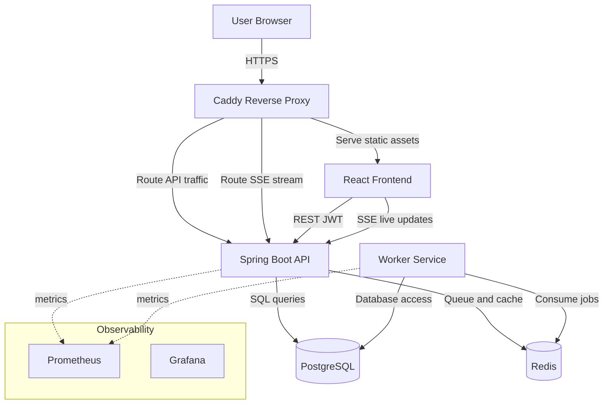
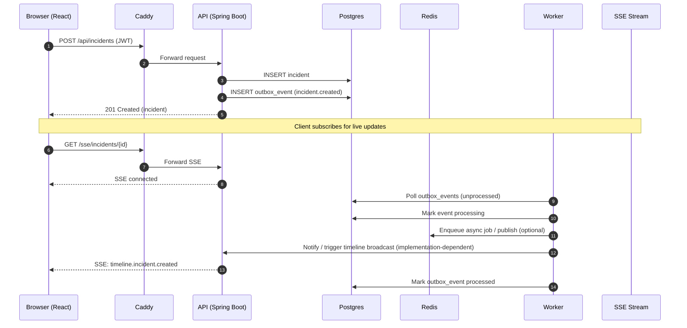

# OpsFlow

**OpsFlow** is a startup-style **incident management and runbook coordination platform** designed to showcase production-style SaaS architecture.

The project simulates a simplified version of tools like **PagerDuty** or **OpsGenie**, allowing teams to track operational incidents, manage services, and coordinate responses with real-time activity streams.

The system emphasizes **modern backend architecture, multi-tenant design, real-time event streaming, and containerized deployment**.

Live Demo: http://3.238.146.215 

Username: you@example.com

Password: devpass123

---

Teams can use OpsFlow to:

* Track operational incidents
* Maintain a catalog of services
* Coordinate incident response
* Monitor live incident activity timelines

The platform uses **event-driven patterns and Server-Sent Events (SSE)** to simulate real-time updates commonly found in production incident management tools.

---

# Architecture Overview

OpsFlow follows a **multi-service architecture** with real-time streaming and background processing.

System Architecture (container level):






### Components

**Frontend**

* React single-page application
* Communicates with backend via REST APIs
* Displays live incident timelines via SSE

**API Service**

* Spring Boot REST API
* Handles authentication, services, incidents, and organization data
* Publishes events to an outbox for asynchronous processing

**Worker Service**

* Background processing service
* Consumes outbox events
* Executes asynchronous tasks

**Infrastructure**

* Docker Compose orchestrates services
* PostgreSQL for persistent data
* Redis for async job coordination
* Caddy reverse proxy for routing and static frontend serving

---

# Tech Stack

### Backend

* Java
* Spring Boot
* REST APIs
* JWT Authentication
* Flyway database migrations

### Frontend

* React
* Vite
* TypeScript
* React Router

### Data & Messaging

* PostgreSQL
* Redis

### Real-Time

* Server-Sent Events (SSE)

### Infrastructure

* Docker
* Docker Compose
* Caddy reverse proxy

### Observability (Local Development)

* Prometheus
* Grafana

### Deployment

* AWS Lightsail Linux VM
* Dockerized services
* Reverse proxy via Caddy

---

# Features

## Authentication & Security

* JWT access and refresh tokens
* Protected frontend routes
* Role-based access control (Owner / Admin / Member)

## Multi-Tenancy

* Organization-based tenant model
* Data isolation using `org_id`

## Incident Management

* Create incidents
* Update severity and status
* Acknowledge incidents
* Resolve incidents
* Live incident activity feed

## Services

* Service catalog
* Services linked to incidents

## Real-Time Updates

* Server-Sent Events stream
* Live incident timeline updates

## Background Processing

* Worker service processes asynchronous jobs

---

# Screenshots

*(Screenshots coming soon)*

Suggested screenshots to include:

* Incident dashboard
* Incident timeline activity feed
* Service catalog view
* Login page

---

# Local Development Setup

The full stack can be run locally using Docker Compose.

### Requirements

* Docker
* Docker Compose
* Node.js
* Java 17+

### Start infrastructure

```
docker compose up -d postgres redis prometheus grafana
```

### Run backend services

API service:

```
cd backend/api
./mvnw spring-boot:run
```

Worker service:

```
cd backend/worker
./mvnw spring-boot:run
```

### Start frontend

```
cd frontend
npm install
npm run dev
```

Frontend will run at:

```
http://localhost:5173
```

---

# Deployment Architecture

OpsFlow is deployed on an **AWS Lightsail Linux VM**.

All services run in **Docker containers managed with Docker Compose**.

Deployment architecture:

```
Browser
↓
Caddy Reverse Proxy
↓
React Frontend (static build)
↓
Spring Boot API
↓
PostgreSQL + Redis
↓
Worker Service
```

The reverse proxy handles routing between the frontend and API services.


