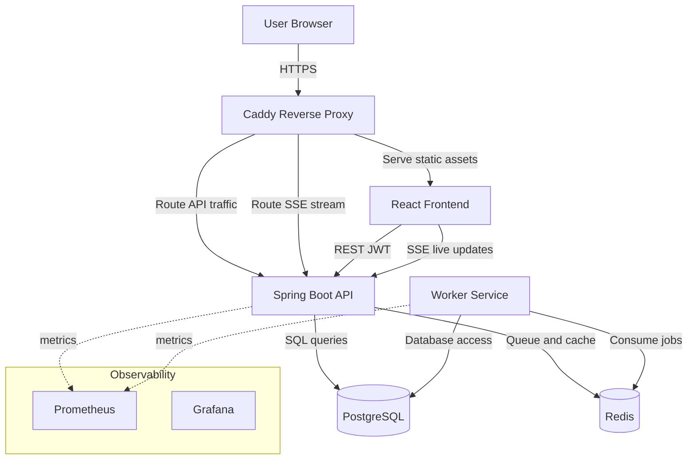
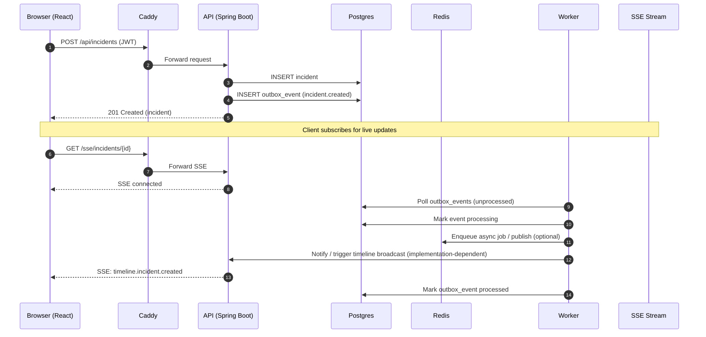
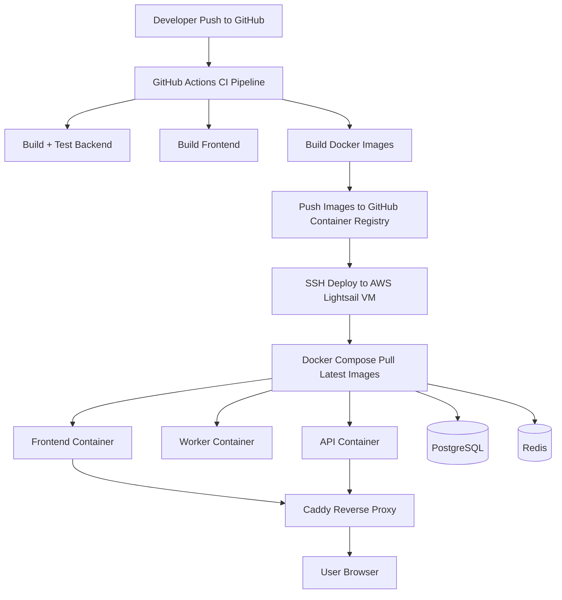

# OpsFlow

<p align="center">


</p>

**OpsFlow** is a startup-style **incident management and runbook coordination platform** designed to showcase production-style SaaS architecture.

The project simulates a simplified version of tools like **PagerDuty** or **OpsGenie**, allowing teams to track operational incidents, manage services, and coordinate responses with real-time activity streams.

The system emphasizes **modern backend architecture, multi-tenant design, real-time event streaming, containerized deployment, and automated CI/CD pipelines for build, test, and deployment**.

Live Demo: http://3.238.146.215 

Username: `you@example.com`

Password: `devpass123`

---

Teams can use OpsFlow to:

* Track operational incidents
* Maintain a catalog of services
* Coordinate incident response
* Monitor live incident activity timelines

The platform uses **event-driven patterns and Server-Sent Events (SSE)** to simulate real-time updates commonly found in production incident management tools.

---

# Architecture Overview

OpsFlow follows a **multi-service architecture** with real-time streaming and background processing.

## System Architecture (container level):



## Incident Event Flow (Outbox + Worker + SSE timeline):



### Components

**Frontend**

* React single-page application
* Communicates with backend via REST APIs
* Displays live incident timelines via SSE

**API Service**

* Spring Boot REST API
* Handles authentication, services, incidents, and organization data
* Publishes events to an outbox for asynchronous processing

**Worker Service**

* Background processing service
* Consumes outbox events
* Executes asynchronous tasks

**Infrastructure**

* Docker Compose orchestrates services
* PostgreSQL for persistent data
* Redis for async job coordination
* Caddy reverse proxy for routing and static frontend serving

---

# Tech Stack

### Backend

* Java
* Spring Boot
* REST APIs
* JWT Authentication
* Flyway database migrations

### Frontend

* React
* Vite
* TypeScript
* React Router

### Data & Messaging

* PostgreSQL
* Redis

### Real-Time

* Server-Sent Events (SSE)

### Infrastructure

* Docker
* Docker Compose
* Caddy reverse proxy
* CD/CD
* GitHub Actions
* GitHub Container Registry (GHCR)
* Automated Docker image builds and deployment

### Observability (Local Development)

* Prometheus
* Grafana

### Deployment

OpsFlow is deployed to an AWS Lightsail Linux VM using a container-based deployment pipeline.

CI/CD is implemented using GitHub Actions. Each push to the main branch:

• Builds backend and frontend services  
• Builds Docker images for api, worker, and frontend  
• Publishes images to GitHub Container Registry (GHCR)  
• Deploys the updated containers to the Lightsail VM over SSH  

Docker Compose manages the running services on the VM, and container health checks ensure the API service is fully started before the deployment is considered successful.

---

# Features

## Authentication & Security

* JWT access and refresh tokens
* Protected frontend routes
* Role-based access control (Owner / Admin / Member)

## Multi-Tenancy

* Organization-based tenant model
* Data isolation using `org_id`

## Incident Management

* Create incidents
* Update severity and status
* Acknowledge incidents
* Resolve incidents
* Live incident activity feed

## Services

* Service catalog
* Services linked to incidents

## Real-Time Updates

* Server-Sent Events stream
* Live incident timeline updates

## Background Processing

* Worker service processes asynchronous jobs

---

# Local Development Setup

The full stack can be run locally using Docker Compose.

### Requirements

* Docker
* Docker Compose
* Node.js
* Java 17+

### Start infrastructure

```
docker compose up -d postgres redis prometheus grafana
```

### Run backend services

API service:

```
cd backend/api
./mvnw spring-boot:run
```

Worker service:

```
cd backend/worker
./mvnw spring-boot:run
```

### Start frontend

```
cd frontend
npm install
npm run dev
```

Frontend will run at:

```
http://localhost:5173
```

---

# Deployment Architecture

OpsFlow is deployed on an **AWS Lightsail Linux VM**.

All services run in **Docker containers managed with Docker Compose**.

Deployment architecture:



CI/CD Pipeline

OpsFlow uses GitHub Actions to automate testing, container builds, and deployments.

Pipeline stages:

1. Continuous Integration
   - Build backend services
   - Run backend tests
   - Build frontend application
   - Build Docker images

2. Container Publishing
   - Images are pushed to GitHub Container Registry (GHCR)

3. Continuous Deployment
   - GitHub Actions connects to the AWS Lightsail VM over SSH
   - Docker Compose pulls the latest images
   - Containers are restarted with the new versions
   - Docker health checks verify that the API service is healthy before completing the deployment

The reverse proxy handles routing between the frontend and API services.

---

# Screenshots

## Login
.png)

## Incident Dashboard
.png)


